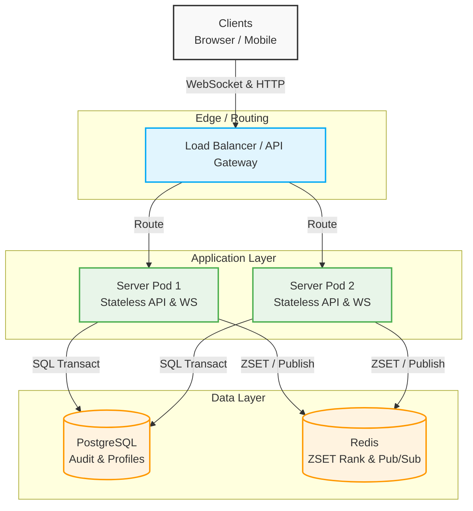
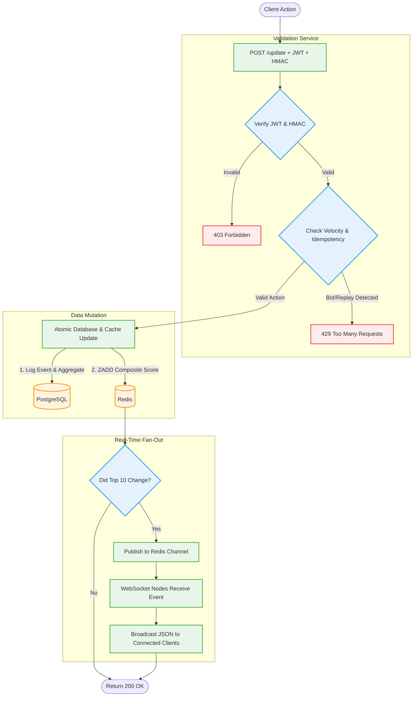
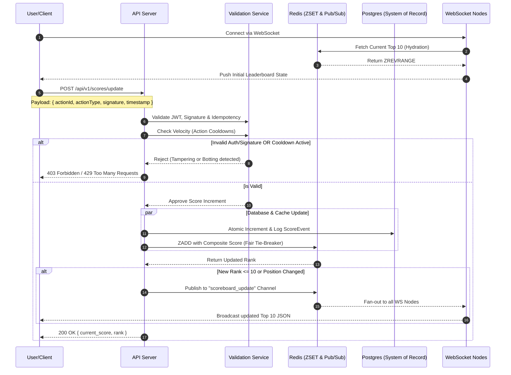

Markdown
# Scoreboard Module Specification

## Executive Summary 
The **Live Leaderboard Module** is a high-performance, horizontally scalable backend service designed to track user scores, validate action integrity, and broadcast real-time updates to the global Top 10 leaderboard. This module is strictly engineered to handle massive concurrency, resolve ranking collisions fairly, prevent automated botting (semantic anti-cheat), and guarantee real-time consistency across distributed server nodes.

---

## 1. Overview

### Purpose
Provide a secure, horizontally scalable API service that:

* Manages user scores and in-game actions.
* Displays the top 10 users with the highest scores.
* Implements live updates via stateless WebSocket connections and Pub/Sub.
* Prevents malicious score manipulation (botting and payload tampering).

### Key Features
* **User Authentication & Authorization:** JWT for identity verification.
* **Action Integrity:** HMAC-SHA256 signatures to prevent request tampering.
* **Semantic Anti-Cheat:** Velocity checks and action cooldowns to block superhuman botting.
* **Fair Tie-Breaking:** Composite fractional scoring to prioritize the first achiever.
* **Real-time Broadcast:** Redis Pub/Sub fan-out to all connected WebSocket nodes.

### Technology Stack (Recommended)
* **Language:** TypeScript / Node.js
* **Framework:** Express.js
* **Real-time:** Socket.io / Native WebSockets
* **Database:** PostgreSQL (System of Record & Audit)
* **Cache:** Redis (ZSET for ranking, Pub/Sub for broadcast)

---

## 2. Architecture Components
* Database (**PostgreSQL**): Permanent storage for user profiles and historical score audit logs.
* Cache (**Redis** Sorted Set): High-speed, in-memory storage for the leaderboard (ranked by score).
* Real-time Layer (**Socket.io** / **WebSockets**): Persistent push layer to broadcast leaderboard changes instantly.
* Validation Layer (**HMAC** / **JWT**): HMAC signatures or Action Tokens to prevent request tampering combined with strict cooldown checks to prevent botting.



---

## 3. API Endpoints

### Base URL
`https://api.domain.com/api/v1/scores`

### 3.1 User Action & Score Update

**Endpoint:** `POST /update`
**Purpose:** Record completion of an action, apply tie-breaker logic, and update the global rank.
**Authentication:** Required (Bearer Token / JWT)
**Request Headers:** 
```HTTP
Content-Type: application/json
Authorization: Bearer <JWT_TOKEN>
```
**Request Body:**

```json
{
  "actionId": "uuid-v4",
  "actionType": "LEVEL_COMPLETED",
  "actionSignature": "hmac_sha256_hash",
  "timestamp": 1712345678
}
```
**Response:** `200 OK` with the user's new total score and current rank.

```json
{
  "meta": { "success": true, "message": "Score updated" },
  "data": { "current_score": 1250, "rank": 8 }
}
```

Error Responses:
* `400 Bad Request` - Invalid payload schema
* `401 Unauthorized` - Missing/expired JWT
* `403 Forbidden` - HMAC Signature mismatch (Tampering detected)
* `429 Too Many Requests` - Action cooldown active (Botting detected)

### 3.2 Retrieve Top 10 Leaderboard

**Endpoint:** `GET /leaderboard`
**Purpose:** Fetch the current top 10 users. Primarily used for HTTP fallbacks or manual refreshes.
**Authentication:** Optional
**Response:** `200 OK` with an array of user objects `{ username, score, rank }`.

```json
{
  "meta": { "success": true, "message": "Leaderboard fetched" },
  "data": [
    { "username": "player_one", "score": 5000, "rank": 1 },
    { "username": "player_two", "score": 4500, "rank": 2 }
  ]
}
```

### 3.3 Leaderboard WebSocket (Real-time Updates)

**WebSocket Endpoint:** `wss://api.domain.com/v1/leaderboard/live`
**Purpose:** Establish a persistent connection for real-time hydration and updates.
**Messages Emitted:** (Server → Client)

* 1. Initial Leaderboard Hydration (Instantly on connection):

```json
{
  "event": "leaderboard:initial",
  "data": [ /* Array of Top 10 Users from Redis */ ]
}
```

* 2. Score Updated Broadcast (When the Top 10 mutates):

```json
{
  "event": "scoreboard_update",
  "data": [ /* Array of New Top 10 Users */ ]
}
```
---

## 4. Authentication & Authorization

### 4.1 JWT Token Structure
```json
Header: 
{ "alg": "HS256", "typ": "JWT" }

Payload: 
{ "userId": "uuid-123", "username": "PlayerOne", "exp": 1712349278 }
```

### 4.2 Action Integrity (HMAC Verification)
* **Authority:** The client never sends the point value. It sends the `actionId`. The server maps that ID to a point value (e.g., `BOSS_KILL = 500pts`) via a secure internal config.

* **Signature:** The `actionSignature` must be a hash of `actionId + userId + timestamp` using a secret key shared between the frontend and backend to prevent proxy tampering.

---

## 5. Fraud Detection & Prevention

### 5.1 Semantic Velocity Checks (Cooldowns)
Cryptographic signatures do not stop bots. The backend enforces game logic velocity.

* Map `actionType` to a minimum completion time (e.g., `LEVEL_COMPLETED` takes a minimum of 15 seconds).
* Store the user's last action `timestamp` in Redis.
* Reject any subsequent request for that action occurring faster than the minimum threshold with a `429 Too Many Requests`.

### 5.2 Network Idempotency
* Store the `actionId` in Redis with a 24-hour TTL.
* If a duplicate `actionId` is received due to network retries, intercept it early and return a `200 OK` with the cached previous response, completely bypassing the database write.

---

## 6. Data Model

### 6.1 Database Schema (PostgreSQL)
**Score Event Audit Table**
```sql
CREATE TABLE score_events (
  id UUID PRIMARY KEY,
  user_id UUID NOT NULL REFERENCES users(id),
  action_id UUID NOT NULL,
  action_type VARCHAR(100) NOT NULL,
  points_awarded INT NOT NULL,
  created_at TIMESTAMP DEFAULT NOW()
);
CREATE INDEX idx_user_action ON score_events(user_id, action_id);
```

**Player Scores Aggregate Table**
```sql
CREATE TABLE player_scores (
  user_id UUID PRIMARY KEY REFERENCES users(id),
  total_points INT DEFAULT 0,
  updated_at TIMESTAMP DEFAULT NOW()
);
```

### 6.2 Caching Strategy (Redis)
**Redis Leaderboard ZSET (Fair Tie-Breakers)**
By default, Redis sorts identical scores lexicographically by the member ID. A composite fractional score ensures the first person to reach a score wins the tie-breaker.
* **Formula:** `<Actual_Score>.<Inverted_Timestamp>`

* **Example:** 5000 points at timestamp `1700000000` -> `5000.8299999999`

* **Command:** `ZADD leaderboard:global <Composite_Score> <userId>`

* **Formatting:** The Service layer strips the decimal before returning the integer score to the frontend.

---


## 7. Execution Flow

1. **Connection & Hydration:** When a client establishes a WebSocket connection, the server immediately fetches the current Top 10 from Redis and pushes it to the client. This ensures the user never stares at an empty scoreboard.
2. **Action Dispatch:** The client completes an in-game action and sends a `POST /api/v1/scores/update` request containing their JWT and an HMAC-signed payload.
3. **Validation Service (Anti-Cheat):** * **Identity & Integrity:** The system first verifies the JWT and the HMAC signature. If invalid, the request is immediately rejected with a `403 Forbidden`.
    * **Velocity & Idempotency:** The system checks for duplicate request IDs (Idempotency) and enforces action cooldowns (Velocity). If a bot or replay attack is detected, it rejects with a `429 Too Many Requests`.
4. **Data Mutation (Atomic Update):** Once validated, the system performs concurrent data updates:
    * **PostgreSQL:** Logs the immutable event in the audit table and updates the user's aggregate total.
    * **Redis:** Calculates a fair tie-breaking composite score (`<Score>.<InvertedTimestamp>`) and updates the `ZSET`.
5. **Threshold Check:** The system evaluates: *Did the Top 10 change?*
    * **If No:** The flow skips the broadcast phase and immediately returns a `200 OK` to the acting client.
    * **If Yes:** The flow triggers the Real-Time Fan-Out phase.
6. **Real-Time Fan-Out & Response:** * The API server publishes a mutation event to a Redis Pub/Sub channel.
    * All active WebSocket nodes receive this event and broadcast the updated Top 10 JSON to their connected clients.
    * Finally, the server returns a `200 OK` to the acting client with their personal updated score and rank.



--- 


## 8. Sequence Diagram (Logic Flow)



---

## 9. Implementation Recommendations

### 9.1 WebSocket Scalability & Hydration
* **Pub/Sub Fan-out:** API servers must not emit directly to WebSockets. The API server updates the ZSET and publishes to a Redis Pub/Sub channel. All active WebSocket worker nodes subscribe to this channel and fan-out the message to their localized clients.

* **Hydration Requirement:** When a client opens a WebSocket connection, the WS connection handler must instantly query `ZREVRANGE leaderboard:global 0 9 WITHSCORES` and emit the initial state so the user never stares at an empty board.

### 9.2 Performance Optimization
* **"Staged" Leaderboard Updates (Debouncing):** Under massive concurrent traffic, broadcasting on every single micro-point increase can saturate the network. Implement a Debounce/Throttling mechanism at the Pub/Sub level (e.g., publish exactly once per 1.0 second only if the state has mutated).

* **Background Workers:** To maintain sub-50ms latency on the POST endpoint, update Redis synchronously, but offload the PostgreSQL audit logs to a Message Queue (e.g., BullMQ) for eventual consistency.

### 9.3 System Resilience
* **Circuit Breaker:** If the Redis cache layer fails, fall back to a "Degraded Mode." Switch to direct PostgreSQL queries (`ORDER BY total_points DESC LIMIT 10`). Latency will increase and WebSockets will downgrade to HTTP polling, but the application remains online.

---

## 10. Known Limitations & Future Improvements
### Current Limitations
* **Global Only:** The current architecture supports a single global leaderboard. Regional or friend-based leaderboards would require additional ZSET structures.

* **Manual Adjustments:** Admin adjustments to scores are not natively integrated into the WebSocket broadcast flow.

### Suggestions for Enhancement
* **Seasonal Resets:** Implement dynamic Redis keys (e.g., `leaderboard:global:2026_04`) to support automatic weekly or monthly leaderboard resets.

* **Machine Learning Fraud Detection:* Feed the PostgreSQL audit logs into a background pipeline to detect complex, non-linear botting patterns that bypass simple velocity checks.


---

## 11. Glossary

| Term | Definition |
| :--- | :--- |
| **ZSET** | Redis Sorted Set; a high-performance, in-memory ranking data structure that provides $O(\log N)$ updates. |
| **HMAC** | Hash-based Message Authentication Code; a cryptographic method used to ensure payload integrity and prevent tampering. |
| **Pub/Sub** | Publish/Subscribe; a messaging pattern used here to fan-out events and scale WebSockets horizontally across multiple server nodes. |
| **Hydration** | The process of immediately pushing the initial data state (Top 10) to a client the moment they connect. |
| **Velocity Check** | Semantic anti-cheat logic that enforces minimum, humanly-possible time limits between in-game actions. |
| **Idempotency** | A system property ensuring that safely handling duplicate network requests (e.g., retries) will not trigger duplicate database writes. |

---

## 12. Contact & Support
* **Primary Owner:** Backend Team Lead
* **Technical Review:** Security & Infrastructure Teams
* **Documentation Updates:** TBD

---

**Document Version:** 1.1
**Status:** Ready for Implementation
