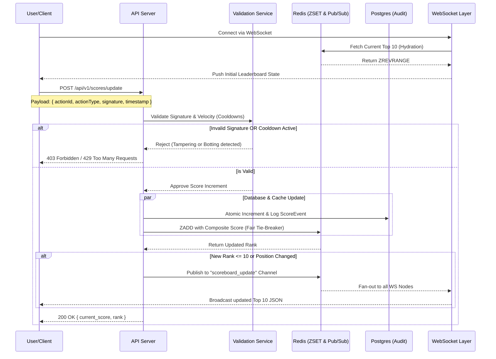

Markdown
# Scoreboard Module Specification

## 1. Overview
The **Live Leaderboard Module** is a high-performance, horizontally scalable backend service designed to track user scores, validate action integrity, and broadcast real-time updates to the global Top 10 leaderboard. This module is strictly engineered to handle massive concurrency, resolve ranking collisions fairly, prevent automated botting (semantic anti-cheat), and guarantee real-time consistency across distributed server nodes.

---

## 2. Architecture Components
* Database (**PostgreSQL**): Permanent storage for user profiles and historical score audit logs.

* Cache (**Redis** Sorted Set): High-speed, in-memory storage for the leaderboard (ranked by score).

* Real-time Layer (**Socket.io** / **WebSockets**): Persistent push layer to broadcast leaderboard changes instantly.

* Validation Layer (**HMAC** / **JWT**): HMAC signatures or Action Tokens to prevent request tampering combined with strict cooldown checks to prevent botting.

---

## 3. Execution Flow
1.  **Connection & Hydration:** When a client establishes a WebSocket connection, the server immediately fetches the current Top 10 from Redis and pushes it to the client (Hydration) so the user never stares at an empty board.

2. **Action Dispatch:** The client completes an action and sends a `POST /api/v1/scores/update` request containing a signed actionToken and unique actionId.

3. **Authorization & Validation (Anti-Cheat):** 
    * **Identity:** Middleware verifies the user's **JWT**.
    * **Integrity:** Service verifies the **HMAC signature** and checks for **Idempotency** (preventing replay attacks).
    * The service enforces **Velocity Checks / Cooldowns** (semantic anti-cheat) to ensure actions aren't being completed faster than humanly possible.

3. **Atomic Update & Tie-Breaking:**
    * **Audit:** The system logs the event in the PostgreSQL `ScoreEvent` table.
    * **Rank:** The system calculate a composite score (`Score.InvertedTimestamp`) and update the Redis `ZSET`.

4.  **Threshold Check & Pub/Sub:** If the user’s new rank enters the Top 10, the API server publishes a message to a Redis Pub/Sub channel.

5.  **Live Broadcast:** All active WebSocket nodes subscribed to the channel receive the message and simultaneously broadcast the `scoreboard_update` event to their connected clients.

--- 

## 4. API Endpoints

### `POST /api/v1/scores/update`
* **Description:** Increments a user's score based on a completed action, applies composite tie-breaker logic, and enforces action cooldowns.
* **Security:** `AuthRequired`, `RateLimit(Auth)`, `HmacVerified`, `VelocityChecked`.
* **Payload:**

```json
{
  "actionId": "uuid-v4",
  "actionType": "LEVEL_COMPLETED",
  "actionSignature": "hmac_sha256_hash",
  "timestamp": 1712345678
}
```
* **Response:** `200 OK` with the user's new total score and current rank.

```json
{
  "meta": { "success": true, "message": "Score updated" },
  "data": { "current_score": 1250, "rank": 8 }
}
```

### `GET /api/v1/scores/leaderboard`
* **Description:** Returns the current top 10 users.
* **Performance:** Fetched directly from Redis for sub-millisecond latency.
* **Response:** `200 OK` with an array of user objects `{ username, score, rank }`.

```json
{
  "meta": { "success": true, "message": "Leaderboard fetched" },
  "data": [
    { "username": "player_one", "score": 5000, "rank": 1 },
    { "username": "player_two", "score": 4500, "rank": 2 }
  ]
}
```

---

## 5. Sequence Diagram (Logic Flow)



---

## 6. Implementation Strategy
To ensure system integrity, developers **must** adhere to the following implementation strategies. These are not optional; they are required to pass security and performance reviews.

### A. Redis ZSET & Fair Tie-Breakers
By default, Redis sorts identical scores lexicographically by the member ID (which is inherently unfair). You **must** implement a composite fractional score to ensure the first person to reach a score wins the tie-breaker.

* **Formula:** `<Actual_Score>.<Inverted_Timestamp>`

* **Implementation logic:** If User A scores `5000` points at `timestamp 1700000000`. Subtract the timestamp from a massive future date (e.g., `9999999999 - 1700000000`) to create the decimal.

* **Redis Command:** `ZADD leaderboard:global <Composite_Score> <userId>`

* **Formatting:** The Service layer must strip the decimal before returning the integer score to the frontend.

### B. Anti-Cheat: Semantic Velocity Checks
* **Authority:** The client never sends the point value. It sends the `actionId`. The server maps that ID to a point value (e.g., `BOSS_KILL = 500pts`) via a secure config.

* **HMAC Verification:** The `actionSignature` must be a hash of the `actionId + userId + timestamp` using a secret key shared between the frontend and backend.

* **Velocity Check:** Map actionType to a minimum completion time (e.g., `LEVEL_COMPLETED` takes a minimum of 15 seconds). Store the user's last action timestamp in Redis. Reject any subsequent request for that action occurring faster than the minimum threshold with a `429 Too Many Requests`.

### C. WebSocket Scalability & Client Hydration

A single Node.js instance will crash under viral load. WebSocket connections must be stateless and horizontally scalable.

* **Pub/Sub Fan-out:** API servers must not emit directly to WebSockets. The API server updates the `ZSET` and publishes to a Redis Pub/Sub channel. All active WebSocket worker nodes subscribe to this channel and fan-out the message to their localized clients.

* **Hydration Requirement:** When a client opens a WebSocket connection, they must not stare at an empty leaderboard waiting for the next person to score. The WS connection handler must instantly query `ZREVRANGE leaderboard:global 0 9 WITHSCORES` and emit the initial state to that specific connection payload immediately.

---

## 7. Improvements & Recommendations
### 1. Idempotency Keys (Network Resilience)
To prevent network retries or manual refreshes from double-counting scores, implement an Idempotency Layer. Store the `actionId` in Redis with a 24-hour TTL. If a duplicate `actionId` is received and return a `200 OK` with the cached previous response, completely bypassing the database write.

### 2. "Staged" Leaderboard Updates (Debouncing)
Under massive concurrent traffic, broadcasting on every single micro-point increase can saturate the network and cause frontend rendering lag.

* **Recommendation:** Implement a **Debounce** / **Throttling** mechanism at the Pub/Sub publisher level. Buffer the updates in memory and publish the new Top 10 to the Redis channel at a fixed interval (e.g., exactly once per 1.0 second) only if the state has mutated.

### 3. Background Workers (Asynchronous Persistence)
To ensure the `POST /update endpoint` maintains sub-50ms latency:

* **Sync:** Update the **Redis** `ZSET` and return the response to the user immediately.

* **Async:** Offload the heavy PostgreSQL audit log (`ScoreEvent`) and aggregate updates to a Message Queue (e.g., BullMQ or RabbitMQ) for eventual consistency processing.

### 4. Circuit Breaker for Redis
If the Redis cache layer fails, the module should fall back to a "Degraded Mode."

* **Logic:** Switch to direct PostgreSQL queries for the Top 10 (`ORDER BY totalPoints DESC LIMIT 10`). While latency will increase and WebSockets will downgrade to HTTP polling, the core application will remain online.
